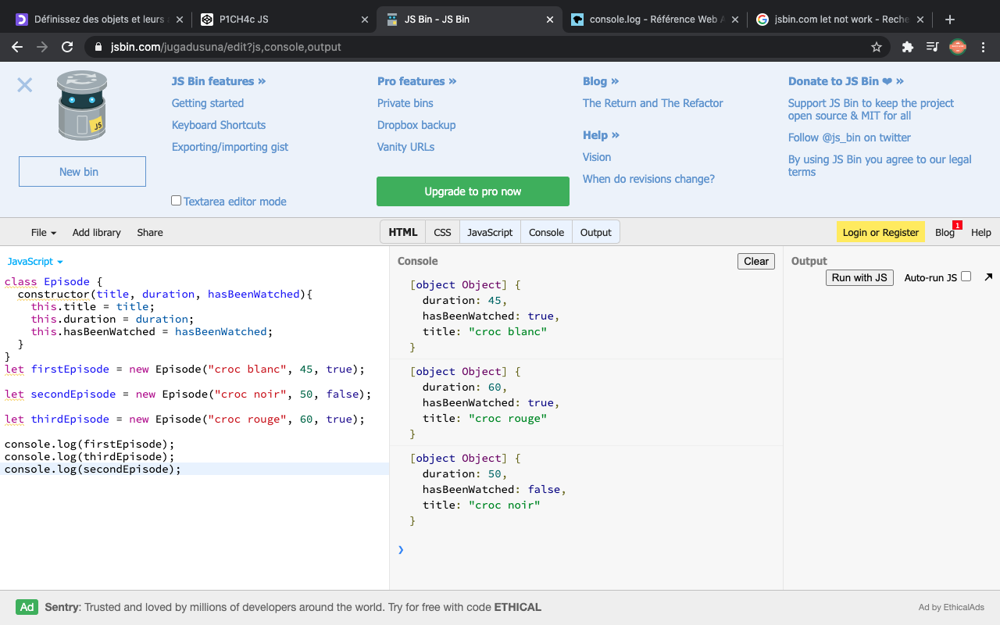
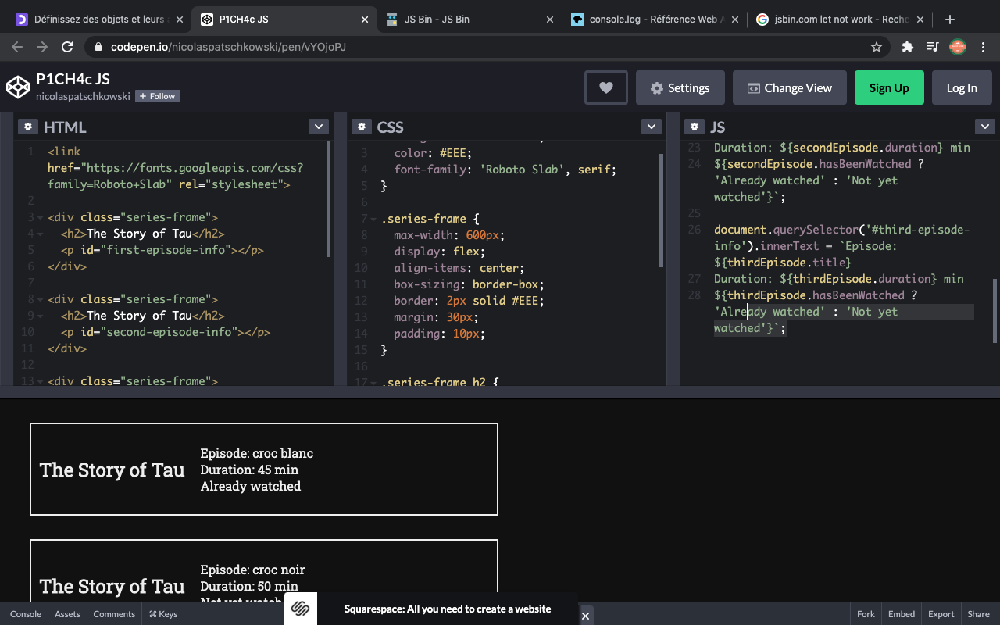
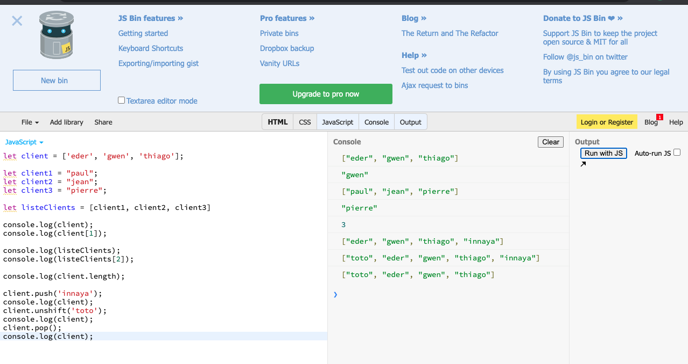
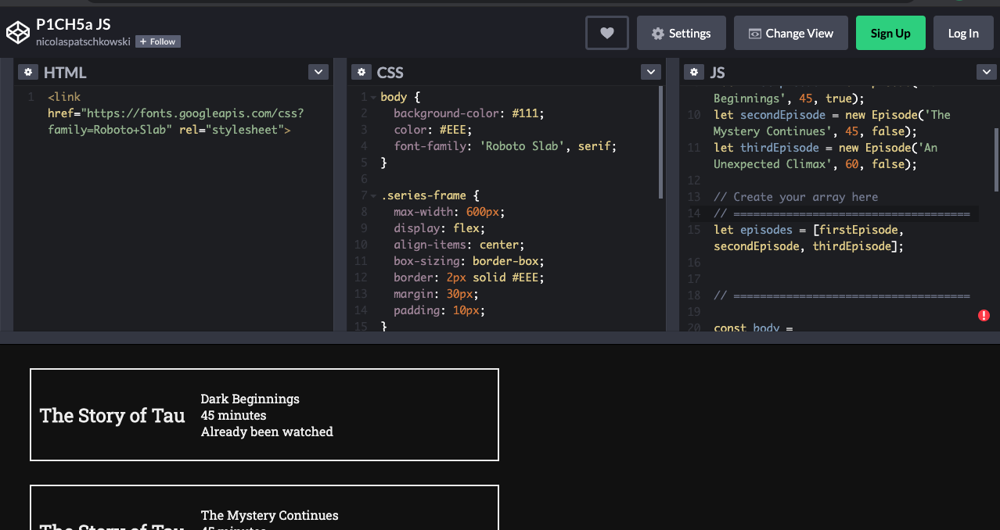
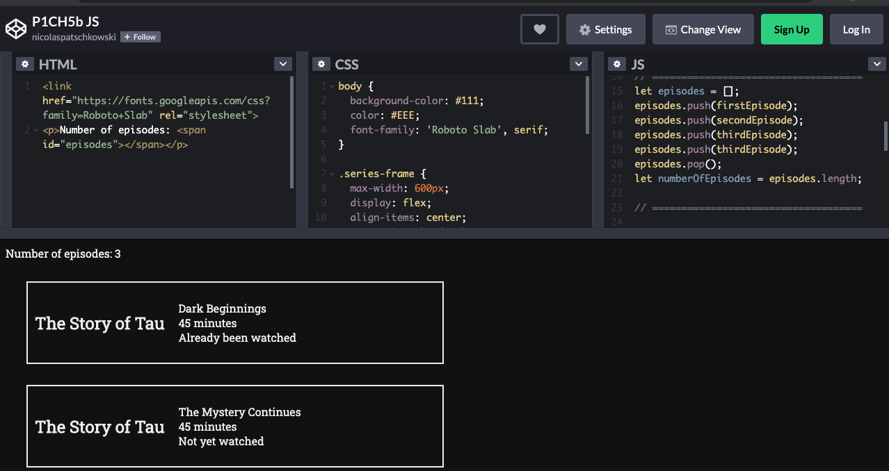

## base of JavaScript with Openclassroom tutorial https://openclassrooms.com/fr/courses/6175841-apprenez-a-programmer-avec-javascript

i create variable 

i create variable with integer, string and boolean

i create object 

i create class

i create array

